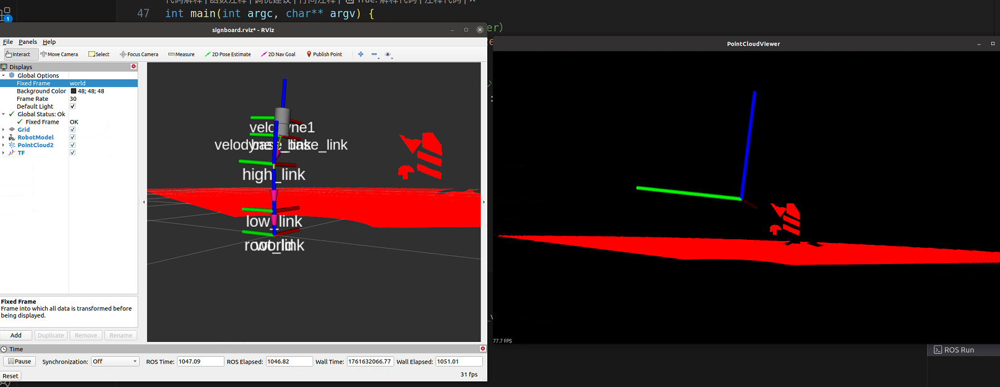
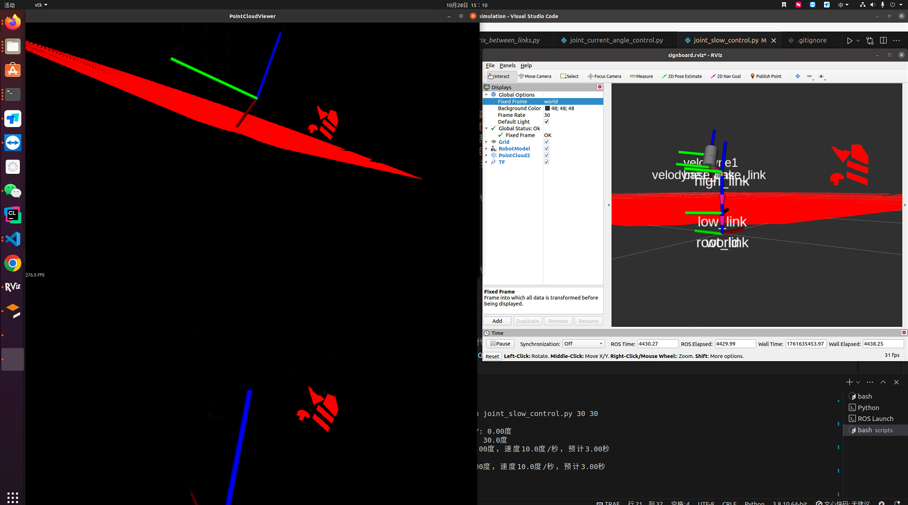

通过这个命令，我们可以查看点云消息的字段信息。
```shell
rostopic echo /points_raw1/fields -n 1
```

```shell
wu@wu:~/catkin_ws$ rostopic echo /points_raw1/fields -n 1
- 
  name: "x"
  offset: 0
  datatype: 7
  count: 1
- 
  name: "y"
  offset: 4
  datatype: 7
  count: 1
- 
  name: "z"
  offset: 8
  datatype: 7
  count: 1
- 
  name: "intensity"
  offset: 12
  datatype: 7
  count: 1
- 
  name: "ring"
  offset: 16
  datatype: 4
  count: 1
- 
  name: "time"
  offset: 18
  datatype: 7
  count: 1
---
```
我这里只获取xyz信息。

当你控制雷达进行旋转时，你可以观察到点云在可视化窗口中的变化。

point_cloud_visualizer.cpp文件的功能是：
订阅/points_raw1话题，只提取xyz并显示。



tf_point_cloud_ground_removal_visualizer.cpp文件的功能是:
雷达坐标系转换到基坐标系，然后去除地面点云，最后转回到雷达坐标系并进行可视化。



编译命令：
```shell
cd ~/catkin_ws
catkin_make -DCATKIN_WHITELIST_PACKAGES="point_cloud_vis"
```